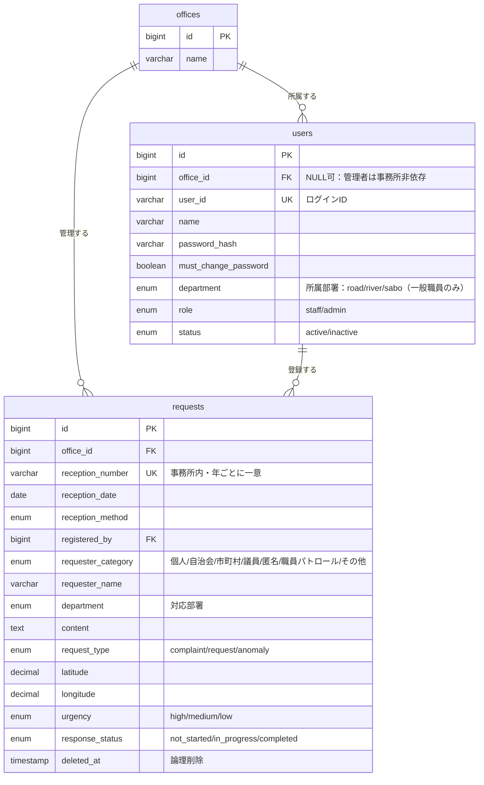
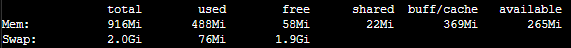
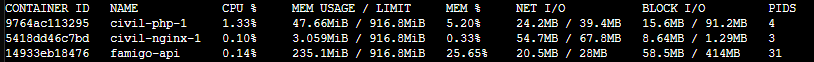

# Civil Track（土木施設要望・対応管理システム）

土木インフラ施設（道路・河川・砂防）に関する住民からの**要望・意見・苦情**、および職員パトロールで見つかる**異常箇所**を、受付から対応完了まで一元管理する庁内業務システム。国や地方自治体における土木事務所での利用を想定しています。

私自身が**土木行政の実務に携わっており**、日々の業務で感じている「**対応漏れを防ぐために、全案件の進捗を網羅的に一目で把握したい**」「過去の対応履歴を探すのに時間がかかる」といった課題を解決するために制作しました（詳細は[制作背景](#本システムの制作背景)を参照）。

---

## 🌐 デプロイURL

**https://civil-track.com**

### デモ用アカウント

ログインして機能を体験できます。**初期パスワードのままログインできます**（体験用アカウントは初回変更を免除）。

| 役割 | ユーザーID | パスワード | 見えるもの |
|---|---|---|---|
| 一般職員<br>（みどり土木事務所／道路） | `staff101` | `Sample#2026` | みどり土木事務所の案件のみ。道路案件を編集・削除可 |
| 一般職員<br>（みどり土木事務所／河川） | `staff102` | `Sample#2026` | みどり土木事務所の案件のみ。河川案件を編集・削除可 |
| 一般職員<br>（つばき土木事務所／道路） | `staff201` | `Sample#2026` | つばき土木事務所の案件のみ。道路案件を編集・削除可 |

> **権限・事務所スコープを体験するには**、異なる事務所・部署の職員でログインし、見える案件・編集できる案件の違いを比べてみてください。
> **システム管理者アカウントは公開していません。** ユーザーの登録・無効化や全事務所の案件を削除できる強い権限を持つため、不特定多数が利用できる公開デモには含めていません（管理者機能は[機能一覧](#機能一覧)・[画面モックアップ](mockup/)を参照）。

---

## システム概要

### 概要

土木インフラ施設を管理する出先機関（土木事務所）では、道路・河川・砂防施設に関する要望・意見・苦情などを、窓口・電話・メール・要望書など複数の手段で日々受け付けています。加えて、職員のパトロールで見つかる施設の異常箇所も対応が必要です。これらが一元管理されていないと、全体像の把握・進捗管理・過去履歴の検索・地理的傾向の分析が困難になります。

**Civil Track** は、これらの情報を1か所に集約し、受付から対応完了までの進捗を可視化することで、業務の効率化と対応品質の向上を図ります。

### ターゲットユーザー

- **一般職員**（要望などの受付・パトロールを行う）：自事務所の全案件を閲覧、担当部署（道路／河川／砂防）の案件を編集・削除
- **システム管理者**：事務所に属さない全体管理者。全事務所の案件・ユーザーを横断して管理

想定同時利用者数は最大30人、想定データ量は年間最大1,000件程度で、事務所内でのクローズド運用を想定しています。

### 設計ドキュメント

要件から設計・インフラまで、各工程のドキュメントを整備しています。

| ドキュメント | 内容 |
|---|---|
| [要件定義書](docs/requirements.md) | 業務背景・機能要件・権限方針・登録項目・非機能要件 |
| [データベース設計書](docs/database-design.md) | ER図・テーブル定義・採番方式・権限制御との対応 |
| [画面設計書](docs/screen-design.md) | 画面一覧・ルーティング設計・権限制御方針・コントローラ対応表 |
| [インフラ設計書](docs/infrastructure-design.md) | AWS 構成・既存環境の共有方針・デプロイ・停止再開 |
| [運用手順](docs/operations-start-stop.md) | EC2/RDS の停止・再開、コード更新デプロイ手順 |
| [画面モックアップ](mockup/) | 全10画面の静的HTMLプロトタイプ |

---

## インフラ構成

**私が別途制作し、すでに AWS 上で稼働している既存環境**（VPC・ALB・EC2・RDS）を共有する形でデプロイしています。詳細は[インフラ設計書](docs/infrastructure-design.md)を参照してください。

> **図を読む前に：「famigo」＝ 私が別途制作した既存の Web アプリです**
>
> 図中の `famigo-vpc` `famigo-ec2` などは、**その既存アプリの AWS リソースを間借りしている**ため元の名前のまま表示されています。`famigo-〇〇` は「既存の〇〇」と読み替えてください。
>
> 右上の凡例のとおり、**グレー＝既存の流用／青＝本システムの新規追加**です（Civil Track が新規に作るのは専用スキーマ・ターゲットグループ等）。


> **なぜ専用環境を新設せず、既存環境を共有したのか**
>
> アプリケーションとして独立している以上、**本来は専用環境を構築するほうが望ましい**構成です。一方で、EC2・RDS・ALB を新規に立てると個人開発では継続しづらい月額コストが発生し、**「動かし続けられずに停止する」ほうが失うものが大きい**と判断しました。
>
> そこで、コストのかかるリソースは共有しつつ、**アプリケーションとしては完全に分離**する方針を採りました。専用の Docker ネットワーク・DB スキーマ・公開ポートで既存システムと分離し、Civil Track のデプロイが既存システムに影響しない構成としています（分離の具体は[工夫した点](#工夫した点)を参照）。結果として、**追加の月額コストを数百円程度に抑えながら**、独自ドメイン + HTTPS の本番環境を常時稼働させています。

---

## 主な使用技術・選定理由

| 区分 | 技術 | バージョン | 用途 |
|---|---|---|---|
| 言語 | PHP | 8.3 | サーバサイドアプリケーション開発 |
| フレームワーク | Laravel | 12 | Webアプリケーション基盤（認証・ORM・ルーティング等） |
| テンプレート | Blade | (Laravel 12 同梱) | サーバサイドレンダリング |
| フロントビルド | Vite / Tailwind CSS | 6 / 3 | 画面スタイルの構築（ビルド時のみ使用） |
| DB | MySQL | 8.4 | データストア（既存 RDS インスタンス内の専用スキーマを利用） |
| 地図 | Leaflet + 国土地理院地図タイル | — | 要望箇所のピン表示 |
| Web サーバ | Nginx | 1.27 (alpine) | リクエスト受付・静的ファイル配信 |
| 実行環境 | Docker / Docker Compose | — | 実行環境のコンテナ化（開発・本番） |
| インフラ | AWS（ALB / EC2 / RDS / Route53 / ACM）+ Terraform | — | 既存 AWS 基盤の活用・インフラのコード管理 |
| 品質 | Laravel Pint / Larastan（PHPStan）/ PHPUnit | — | 整形・静的解析・テスト |

**【選定理由】**

- **Laravel（PHP）**：フォーム入力・検索・一覧が中心の業務システムのため、認証やDB連携が標準で揃う本フレームワークを採用。**マイグレーションでDBの変更履歴をコード管理**でき、長期運用での再現性を確保しやすい。
- **Blade**：本システムはCRUD・検索・一覧表示が中心であり、React等によるSPA構成を採用するメリットが小さいと判断した。Laravel標準のテンプレート機能を利用することで、システム構成をシンプルに保ち、開発効率と保守性を両立した。
- **MySQL**：Laravel との親和性が高く、**既存 AWS 環境のDBサーバーを活用**することで新規サーバーが不要。専用の領域と接続ユーザーを設け、既存システムとのデータ分離も両立している。
- **Leaflet + 国土地理院地図**：地点表示が主目的で高度な地図機能は不要のため、軽量な構成を選択。**無料・API キー不要**で運用コストがかからず、公共事業で使われる地図との親和性も高い。
- **Docker**：実行環境をコンテナ化し、開発環境と本番環境の差異を最小化。手順がコードとして残るため、環境依存の不具合を防げる。
- **Terraform**：インフラ構成をコード管理し、構築手順の属人化を防止。**稼働中の既存システムへ後から追加する構成のため、本システム用リソースのみを管理対象とし、既存側には変更を加えない**方針とした。

---

## DB設計

本システムでは、事務所・ユーザー・案件を中核とする最小構成の3テーブル設計を採用し、業務要件を満たしながらデータ構造をシンプルに保っています。詳細は[データベース設計書](docs/database-design.md)を参照してください。

### テーブル概要

| テーブル | 役割 | 主なカラム |
|---|---|---|
| `offices` | 事務所マスタ | 事務所名 |
| `users` | ユーザーアカウント | ログインID・氏名・所属事務所・担当部署（道路/河川/砂防）・権限（一般職員/管理者） |
| `requests` | 案件（要望・苦情・異常箇所） | 受付番号・受付日時・受付方法・区分・要望者・対応部署・内容・種別・緯度経度・緊急性・対応状況 ほか |

### ER図



> **図の補足**
> - `users.office_id` は **NULL 可**（システム管理者は特定の事務所に属さないため）。
> - `requests.registered_by` は `users.id` への外部キー（案件の登録者）。
> - `reception_number` の `UK` は単独ではなく **`office_id` との複合ユニーク**（別事務所には同じ番号が存在しうる）。
> - `department` は 2 テーブルにあるが意味が異なる。`users.department` は職員の**所属部署**、`requests.department` はその案件の**対応部署**。

**設計のポイント**

- **受付番号は「事務所ごと・年ごと」に採番**（例 `2026-0142`）。**同一事務所内で年ごとに一意**のため、別事務所に同じ番号が存在しうる。トランザクション内の行ロック + ユニーク制約で同時登録の重複を防止。
- **事務所スコープ**：一般職員は自事務所の案件のみ、システム管理者は全事務所を横断。案件の `office_id` は登録時点で固定（異動後も過去案件は元事務所に残る）。
- **論理削除**（`deleted_at` / Laravel SoftDeletes）：削除操作でも行は物理的に残す。画面からの復旧機能は未実装だが、誤削除時にDB側で追跡・復元できる余地を残している。
- **個人情報を極力持たない方針**：相手方の住所・連絡先・性別・年齢等は保持せず、「区分」「要望者（氏名・団体名等）」の2項目のみに限定した。

---

## 機能一覧

全10画面で、認証・案件管理・検索・地図・ユーザー管理をカバーします。

| # | 画面 | 概要 | 権限 |
|---|---|---|---|
| 1 | ログイン | ID・パスワード認証 | 未認証 |
| 2 | パスワード変更 | 初回ログイン時は強制、以降は任意 | 全ユーザー |
| 3 | 案件一覧・検索 | 受付期間（範囲指定）、対応部署・対応状況・緊急性・事務所（いずれも複数選択可）、住所・キーワード（いずれも部分一致）で絞り込み、結果の一覧表示とCSV出力 | 全ユーザー |
| 4 | 案件詳細 | 案件の全属性を表示 | 全ユーザー |
| 5 | 案件新規登録 | 受付情報・要望者・対応情報を入力して登録（受付番号は自動採番） | 一般職員のみ（管理者は事務所に属さないため登録不可） |
| 6 | 案件編集・削除 | 登録済み案件の修正・削除（削除は論理削除） | 担当部署と案件の対応部署が一致する一般職員、または管理者 |
| 7 | 地図表示 | 要望箇所をピン表示、検索条件と連動（Leaflet） | 全ユーザー |
| 8 | ユーザー一覧 | 全事務所のユーザーを横断表示。無効化・再有効化・完全削除・パスワード再発行の操作もここから行う | 管理者のみ |
| 9 | ユーザー登録 | アカウント発行（本人登録は不可） | 管理者のみ |
| 10 | ユーザー編集 | 氏名・所属事務所・担当部署・権限区分の変更（異動・入力ミスの訂正等） | 管理者のみ |

**特徴的な機能**

- **権限・事務所スコープ制御**：ログインユーザーの所属事務所・担当部署・権限に応じて、閲覧・編集・削除できる範囲を制御。
- **複数選択 + AND/OR を組み合わせた条件検索**：項目間は AND、同一項目内（対応部署等）は OR。地図表示にも同じ検索条件を適用。
- **CSV出力**：BOM付き UTF-8。`streamDownload` + `chunk` で大量データでもメモリを圧迫しない。
- **地図可視化**：緯度経度を持つ案件を Leaflet + 国土地理院地図タイルでピン表示。

---

## ルーティング設計

Laravel のリソースルーティングに沿って、リソース単位で HTTP メソッドを使い分けています。以下は中心となる案件（`requests`）リソースの抜粋です。**全ルートは[画面設計書](docs/screen-design.md#2-ルーティング設計)（2章）を参照**してください。

| メソッド・パス | 処理 | 権限 |
|---|---|---|
| `GET /requests` | 一覧・検索（検索条件はクエリパラメータ） | 全ユーザー（自事務所のみ） |
| `GET /requests/create` | 新規登録フォーム | 一般職員 |
| `POST /requests` | 登録（受付番号を自動採番） | 一般職員 |
| `GET /requests/{request}` | 詳細表示 | 全ユーザー（自事務所のみ） |
| `GET /requests/{request}/edit` | 編集フォーム | 担当部署一致 or 管理者 |
| `PUT /requests/{request}` | 更新 | 担当部署一致 or 管理者 |
| `DELETE /requests/{request}` | 削除（論理削除） | 担当部署一致 or 管理者 |
| `GET /requests-export` | CSV出力（一覧と同じ検索条件を引き継ぐ） | 全ユーザー（自事務所のみ） |

**設計のポイント**

- **URL は内部ID（`{request}`）で構成**し、表示上は受付番号を使う。受付番号は事務所ごとに独立した採番のため、URL の一意なキーには使えない。
- **権限はルート定義側で担保**：`can:update,request` 等のミドルウェアを付与し、コントローラに到達する前に弾く。他事務所の案件はスコープにより取得できず 404 となる。
- **JSON を返すのは `GET /map/pins`（GeoJSON）のみ**。地図のピンを非同期取得する用途で、それ以外の画面はサーバサイドで HTML を生成する。
- **ヘルスチェック用の `GET /health`** は認証不要。ALB がターゲットの死活監視に使うため、DB 等の外部依存を見ずアプリの応答自体を確認する。

---

## 操作画面（デモ動画）

<!-- ▼ 動画の貼り付け方（撮影後の作業メモ）
     1. GitHub の Issue コメント欄に MP4 をドラッグ&ドロップ（投稿は不要。URL だけ発行される）
     2. 生成された https://github.com/user-attachments/assets/xxxx の URL をコピー
     3. 下表の「（未撮影）」を  https://... の URL に差し替える（URL を直書きするだけで再生される）
     ※ 動画はリポジトリにコミットしない（理由は CLAUDE.md 8章）
     ※ 推奨：1280x720 / 30秒〜1分 / 10MB以下 / 音声なし
-->

| # | シーン | 見どころ |
|---|---|---|
| 1 | ログイン → 初回パスワード変更 | 初回ログイン時は変更を強制（`must_change_password`） |
| 2 | 案件一覧で条件検索 | 対応部署・対応状況・緊急性の**複数選択**＋キーワードでの絞り込み |
| 3 | 案件の新規登録 | 受付番号が**事務所ごと・年ごとに自動採番**される |
| 4 | 案件の編集・削除 | 担当部署の案件を更新／削除は論理削除（`deleted_at`）で、データ自体はDBに残る |
| 5 | 地図表示 | 検索条件と連動してピンが絞り込まれ、ピンから詳細へ遷移 |
| 6 | 権限の違い（一般職員） | 他部署の案件には編集ボタンが出ない／他事務所の案件は表示されない |
| 7 | システム管理者の権限 | 全事務所を横断して閲覧・編集できる一方、**案件の新規登録はできない**（事務所に属さないため登録主体になれない） |
| 8 | ユーザー管理（管理者のみ） | 全事務所のユーザーを横断表示。登録・編集・無効化・再有効化・完全削除・パスワード再発行 |

### 1. ログイン → 初回パスワード変更

https://github.com/user-attachments/assets/538fab08-f014-46ff-abf3-2c29e7c832df

### 2. 案件一覧で条件検索

https://github.com/user-attachments/assets/4c7a95d5-1718-40e9-8380-f0d8ba8d6648

### 3. 案件の新規登録

https://github.com/user-attachments/assets/c4253be5-192e-407e-a392-0e27db48c2b6

### 4. 案件の編集・削除

https://github.com/user-attachments/assets/fa443aa5-7007-4616-84d8-290a1d0378d4

### 5. 地図表示

https://github.com/user-attachments/assets/56f22a28-778c-4bbd-a9d4-4261f1968414

### 6. 権限の違い（一般職員）

https://github.com/user-attachments/assets/4b4c4fd5-dc0c-48b9-9aee-ec35657d2fc6

### 7. システム管理者の権限（全事務所横断／案件の新規登録は不可）

https://github.com/user-attachments/assets/0f5ab6c2-6f25-42c9-af68-e63f65e3043a

### 8. ユーザー管理（管理者のみ）

https://github.com/user-attachments/assets/f9b984d4-b3ca-4c5d-8de5-594ce866e6a1

---

## 本システムの制作背景

### なぜ「土木行政」を題材にしたか

私自身が土木行政の実務に携わっており、**日々の業務の中で感じている課題を題材にしました**。

土木事務所には、住民からの要望・苦情や、職員のパトロールで見つかる施設の異常箇所が、窓口・電話・メール・要望書など多様な経路で日々寄せられます。しかし、これらは案件ごとに担当者が個別に把握していることが多く、次のような場面で手間が生じます。

- **対応漏れの防止**：対応状況が担当者ごとに管理されているため、全案件の進捗を一目で見渡せず、未着手のまま埋もれる案件が生じうる
- **過去の対応履歴の参照**：「同じ場所で以前も要望があったか」を調べるのに時間がかかる
- **地理的な傾向の把握**：どのエリアに要望が集中しているかを俯瞰する手段がない

これらは「受付から対応完了までを1か所に集約し、検索・可視化できる」だけで大きく改善できると考え、**Civil Track** を制作しました。

### 実務知見を反映した設計

汎用の問い合わせ管理ではなく、土木行政の業務実態に合わせた設計にしています。

| 設計 | 実務上の理由 |
|---|---|
| 要望者区分に**「議員」「自治会」「市町村」**を設ける | 行政では住民個人だけでなく、議員・自治会・近隣市町村からの要望が実際に多く、後から集計する際に区別できる必要がある |
| **職員パトロール**を、受付方法と要望者区分の両方に用意 | パトロールで発見した異常箇所も「対応が必要な案件」であることは同じ。要望と別の器に分けず、同じ台帳で一元管理する |
| 区分が「匿名」「職員パトロール」なら**要望者名を不要**にする | 匿名の申し出やパトロール由来の案件には相手方が存在しない。必須にすると現場でダミー入力が発生する |
| **事務所 × 担当部署（道路／河川／砂防）** で権限を分ける | 土木事務所は管轄区域ごとに分かれ、内部も施設種別で部署が分かれている。他事務所の案件が見えると実務上ノイズになる |

### 開発プロセスとして重視したこと

単に機能を実装するだけでなく、**要件定義・DB設計・画面設計・インフラ設計などの上流工程から、本番環境へのデプロイまでを一貫**して実施しました。要件整理から運用を見据えたシステム構築まで、一連の開発プロセスを経験することを重視しています。

---

## 工夫した点

### ◆ 既存環境を共有しつつ、アプリケーションは分離する

コストのかかる AWS リソース（VPC・ALB・EC2・RDS）は既存環境と共有する一方、**アプリケーションとしては互いに干渉しない**よう、レイヤーごとに分離しています。

| レイヤー | 分離方法 |
|---|---|
| ネットワーク | 専用の Docker ネットワークを作成し、コンテナ間の名前解決を分離 |
| データベース | 同一 RDS 内に**専用スキーマ**を作成。アプリ用ユーザーの `GRANT` を自スキーマのみに限定し、他システムのデータには接続情報上アクセスできない |
| 公開ポート | EC2 上の待ち受けポートを分離（既存システム 8080 / Civil Track 8081） |
| ルーティング | ALB の**ホストベースルーティング**でドメイン単位に振り分け |

これにより、**追加の月額コストを数百円程度に抑えつつ**、独自ドメイン + HTTPS の本番環境を構築しました。

### ◆ 「動くはず」で終わらせず、実測して裏を取る

1台の EC2（t3.micro）に複数アプリを同居させる構成のため、**メモリ不足でコンテナが落ちるリスク**が設計段階から想定されました。設計書に「デプロイ後に実測すること」を条件として明記し、実際に計測して判断しています。

**実測結果（2026-08-15）**

OS 全体のメモリ使用状況（`free -h`）



コンテナ単位の CPU・メモリ使用率（`docker stats`）



| 観点 | 実測値 | 判定 |
|---|---|---|
| メモリ | 空き（`available`）265Mi / 全体 916Mi（**28.9%**） | 判断基準（残20%）を上回り余裕あり |
| CPU | 全コンテナ **1.33% 以下** | 問題なし |
| Civil Track の消費 | php + nginx で **50.7MiB（全体の 5.5%）** | 同居が逼迫要因になっていない |
| 最大の消費元 | famigo（Java）**235.1MiB（25.65%）** | 本システムの約5倍 |

**結論：上位インスタンス（t3.small）への変更は不要**と判断しました。「同居させると不安定では」という懸念に対し、**推測ではなく数値で回答できる状態**にしています。

> `free`（58Mi）だけを見ると逼迫しているように映りますが、`buff/cache`（369Mi）は Linux が高速化のために一時借用している領域で、必要時に解放されます。判断は **`available`（265Mi）** で行っています。

### ◆ Infrastructure as Code（Terraform）

ALB のリスナールール（ホストベースルーティング）・ACM 証明書・Route53 レコード・ターゲットグループ等を Terraform でコード化。**既存環境のリソースは `data` ソースで参照するのみ**とし、Civil Track が追加する分だけを `resource` として宣言的に管理しています。`terraform plan` が**既存リソースに対して 0 変更・0 破棄**となることを担保し、稼働中のシステムを壊さない構成にしています。

### ◆ 権限・事務所スコープの多層制御

「自事務所のみ閲覧」「担当部署のみ編集」「管理者は全横断」を、認証ミドルウェア・Policy・クエリスコープで多層的に制御。DB制約だけでは表現しきれない業務ルールをアプリケーション層で担保しています。

### ◆ ローカルと本番の構成統一

ローカル（Docker Compose）と本番を同じ nginx + php-fpm 構成に揃え、環境差異による不具合を抑制。本番はソースをイメージに焼き込む不変成果物としてデプロイしています。

### ◆ 想定規模に見合った技術選定

「同時利用者 最大30人・年間データ量 最大1,000件程度」という想定規模（1事務所あたり1日3〜4件の受付）を前提に、過剰な構成を避ける判断をしています。

| 判断 | 理由 |
|---|---|
| 専用 RDS を立てず既存インスタンス（db.t4g.micro）を共有 | 案件は3年保存でも数千件規模。既存インスタンスのストレージ（20GB）に対して余裕があり、共有しても圧迫しない |
| EC2 1台構成（冗長化・スケールアウトなし） | 同時30人であれば単一インスタンスで賄える |
| キーワード検索は `LIKE` による部分一致 | 数千件規模ではインデックスなしの部分一致でも実用上問題なく、全文検索の導入は過剰と判断（[今後の展望](#今後の展望)参照） |

実在の自治体を調査した数値ではなく、業務実態から置いた設計上の前提です。規模が変われば上記の判断はいずれも見直す必要があります。

---

## 今後の展望

**短期**
- **現場写真の添付機能**（道路の陥没・施設の破損などは文章より写真のほうが状況が正確に伝わるため、実務上の優先度が高い。画像は S3 に保存し、EC2・RDS のストレージを圧迫しない構成を想定）
- **対応経過の記録機能**（現状は対応状況の「今の状態」のみを保持。現地確認・業者手配・完了といった経過を履歴として残せるようにする）
- キーワード検索の高度化（現状は `LIKE` による部分一致。MySQL FULLTEXT（Ngram パーサ）での全文検索への切り替えを、日本語の検索精度を検証したうえで検討）

**中長期**
- 地図上の範囲指定検索（緯度経度の範囲／空間インデックス）
- GitHub Actions による CI/CD 自動デプロイ（現状は手動デプロイ）
- データ保存期間（3年）経過後の廃棄バッチ

---

## 開発・学習メモ

開発・デプロイを通じた個人の学習・振り返りメモを [`docs/learning/`](docs/learning/) に置いています（AWSデプロイの仕組み・デプロイ振り返り。HTML）。

---

## ローカル環境で動かす

**公開デモでは伏せている管理者アカウントを含め、全機能を手元で検証できます。** Docker Desktop があれば、7ステップで起動します（PHP・MySQL・Node.js のインストールは不要）。

<details>
<summary><strong>構築手順を開く（Docker Compose・所要5〜10分）</strong></summary>

ローカルは Docker Compose で **nginx + php-fpm + mysql** の3コンテナ構成で動かします
（本番の Nginx + PHP-FPM 構成に揃える。[インフラ設計書 3.2節](docs/infrastructure-design.md)参照）。

### 前提

- **Docker Desktop**（Docker Compose v2 を同梱）… インストールのうえ**起動しておく**こと。手順の `docker compose` コマンドは Docker Desktop が起動していないと失敗します
- **Git** … リポジトリの取得（`git clone`）に使用。インストールのみで設定は不要です（ZIP ダウンロードで代替も可）
- **ホストに PHP / Composer / MySQL / Node.js は不要**（すべてコンテナ内で実行するため、事前に用意するのは上記2つのみ）

### 手順（初回）

```bash
# 1. リポジトリを取得してディレクトリへ移動
git clone https://github.com/tomo-taka108/Civil-Request-Management.git
cd Civil-Request-Management

# 2. 環境変数ファイルを作成
#    Windows(PowerShell) の場合は次行の代わりに: Copy-Item .env.example .env
cp .env.example .env

# 3. イメージをビルド（初回は数分かかります）
docker compose build

# 4. PHP依存関係をインストール
#    この時点では vendor/ が空で php-fpm が起動できないため、
#    exec ではなく run --rm（使い捨てコンテナ）で実行する
docker compose run --rm php composer install

# 5. コンテナを起動
docker compose up -d

# 6. アプリケーションキーを生成
docker compose exec php php artisan key:generate

# 7. マイグレーション＋初期データ投入
docker compose exec php php artisan migrate --seed
```

ブラウザで <http://localhost:8081> を開き、初期管理者（下記「初期データ」参照）でログインできれば成功です。

> **補足**
> - `docker compose exec php <コマンド>` は「起動中の php コンテナ内で実行する」という意味です。PHP・Composer はコンテナに同梱されているため、ホスト側へのインストールは不要です。
> - **手順7まで完了してからブラウザを開いてください。** 手順6の前は `APP_KEY` が未設定のためエラー画面（`MissingAppKeyException`）になります。
> - 初回は MySQL の初期化に十数秒かかります。手順7で接続エラーが出る場合は、`docker compose ps` で mysql が `healthy` になるのを待ってから再実行してください。

### 手順（2回目以降）

```bash
docker compose up -d     # 起動
docker compose down      # 停止
```

| サービス | ホスト側ポート | 用途 |
|---|---|---|
| nginx | 8081 | アプリケーション（ブラウザからアクセス） |
| mysql | 3307 | DBクライアントからの直接接続用（コンテナ内では 3306） |

### 初期データ

`migrate --seed`（または `db:seed`）で以下が投入されます（すべて冪等）。

- 初期管理者 `admin`（初期パスワード `ChangeMe#2026`）
- 3事務所（みどり／つばき／こはく土木事務所）
- 体験用サンプル：一般職員9名（`staff101`〜`staff303`、パスワード共通 `Sample#2026`）、サンプル案件約30件

> **上記の認証情報はローカル環境専用の初期値です。** ローカル環境は各自の PC 上の MySQL コンテナに接続するため、本番環境（AWS の RDS）とはデータベースが完全に分離されています。**本番の管理者アカウントには別のパスワードを設定済み**であり、公開もしていません（[デモ用アカウント](#デモ用アカウント)参照）。
>
> ローカルでは管理者としてログインできるため、公開デモでは試せないユーザー管理機能も含めて全機能を確認できます。

氏名・団体名・地名はすべて架空です（実在の個人・団体・市町村を指しません。CLAUDE.md 6章）。

### よく使うコマンド

```bash
# artisan（コンテナ内で実行）
docker compose exec php php artisan <command>

# DBをまっさらにして作り直し＋初期データ投入
docker compose exec php php artisan migrate:fresh --seed

# コンテナ停止＋ボリューム削除（DBを完全にリセット）
docker compose down -v
```

### 品質チェック（コミット前）

```bash
docker compose exec -T php ./vendor/bin/pint --test                          # 整形
docker compose exec -T php ./vendor/bin/phpstan analyse --memory-limit=512M  # 静的解析
docker compose exec -T php php artisan test                                  # テスト
```

</details>

---

## 補足：システム名称と内部識別子の違いについて

本 README で使用している **「Civil Track」は表示名**です。一方、GitHub リポジトリ名・DBスキーマ名・内部識別子には `Civil-Request-Management` / `civil_request_management` を用いており、名称が一致しません。

これは開発途中で表示名を決めたためです。改名にはリポジトリ URL・DBスキーマ・各種設定の変更が伴い、動作中の本番環境にも影響するため、**実害がないと判断して内部名は変更していません。**
