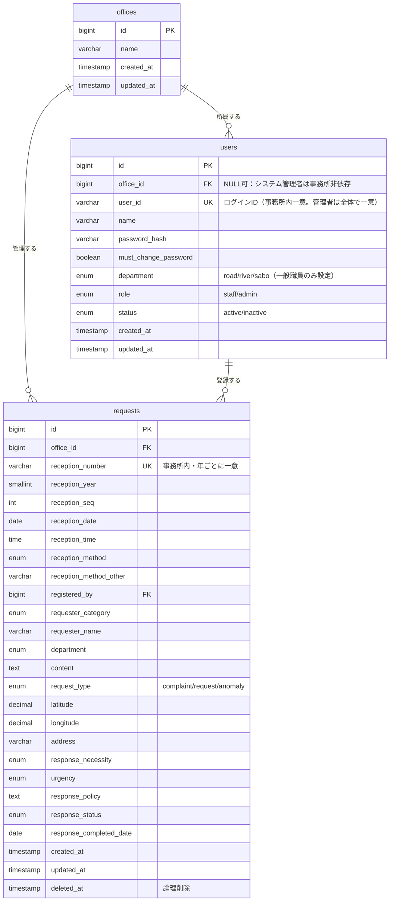

# データベース設計書

最終更新日: 2026-07-20

対象DB：MySQL（既存 `famigo-mysql` インスタンス内に新規スキーマを作成）。
本設計は [要件定義書](requirements.md) の「3. 登録項目」「1.3 想定利用者・権限方針」を正規化したもの。変更履歴は`git log docs/database-design.md`を参照。

---

## 1. ER図

---

## 2. テーブル定義

### 2.1 offices（事務所マスタ）

要件定義書 1.3「事務所ごとのデータ分離方式」に基づき、ユーザー・案件を事務所単位で分離するためのマスタ。

| カラム名 | 型 | 制約 | 備考 |
|---|---|---|---|
| id | BIGINT UNSIGNED | PK, AUTO_INCREMENT | |
| name | VARCHAR(100) | NOT NULL, UNIQUE | 例：〇〇土木事務所 |
| created_at | TIMESTAMP | NOT NULL | |
| updated_at | TIMESTAMP | NOT NULL | |

---

### 2.2 users（ユーザーアカウント）

要件定義書 3.1「ユーザーアカウント項目」に対応。

| カラム名 | 型 | 制約 | 備考 |
|---|---|---|---|
| id | BIGINT UNSIGNED | PK, AUTO_INCREMENT | |
| office_id | BIGINT UNSIGNED | **NULL可**, FK → offices.id | 所属事務所（ログイン時の事務所判定に使用）。**`role`が`admin`の場合はNULL**（要件定義書1.3：システム管理者は事務所非依存の全体管理ロール）。異動時はシステム管理者が更新できる。異動後は新しい事務所の案件のみ閲覧・編集対象になる（`requests.office_id`は登録時点の値で固定されるため、以前の事務所で登録した案件は異動後に見えなくなる） |
| user_id | VARCHAR(50) | NOT NULL, UNIQUE | ログインに使用。**システム全体で一意**。入力ミスの訂正等のため登録後もシステム管理者が変更できる |
| name | VARCHAR(100) | NOT NULL | 氏名 |
| password_hash | VARCHAR(255) | NOT NULL | bcrypt等でハッシュ化して保持 |
| must_change_password | BOOLEAN | NOT NULL, DEFAULT TRUE | 初期パスワードのままか。初回ログイン時の強制変更判定に使用 |
| department | ENUM('road','river','sabo') | NULL可 | 担当部署（道路／河川／砂防）。編集・削除権限の判定に使用。**`role`が`admin`の場合はNULL**（管理者は担当部署によらず全案件を編集・削除できるため） |
| role | ENUM('staff','admin') | NOT NULL, DEFAULT 'staff' | 権限区分（一般職員／システム管理者） |
| status | ENUM('active','inactive') | NOT NULL, DEFAULT 'active' | アカウント状態（有効／無効化） |
| created_at | TIMESTAMP | NOT NULL | |
| updated_at | TIMESTAMP | NOT NULL | |

**インデックス**
- `UNIQUE(user_id)` — ログインID重複チェック。`office_id`がNULL（管理者）になり得るため、事務所単位の複合ユニークではなく単一カラムのユニーク制約とする
- `INDEX(office_id, status)` — 事務所ごとのユーザー一覧の絞り込み用（`office_id`がNULLの管理者はこのインデックスでは絞り込まれない。管理者一覧は`role = 'admin'`で別途取得）

**制約**
- `role = 'admin'` のとき `office_id IS NULL` かつ `department IS NULL`、`role = 'staff'` のとき両方 NOT NULL となることをアプリケーション層（バリデーション）で担保する。DBのCHECK制約による強制は行わない（MySQL 8のCHECK制約は列挙体との相性上、Laravel側での担保を基本方針とする）

> ユーザー本人による新規登録は行わないため、メールアドレス等の登録経路は持たない（要件定義書 2.5参照）。

---

### 2.3 requests（案件：苦情・要望・異常箇所）

要件定義書 3章「登録項目」に対応。

| カラム名 | 型 | 制約 | 備考 |
|---|---|---|---|
| id | BIGINT UNSIGNED | PK, AUTO_INCREMENT | 内部キー |
| office_id | BIGINT UNSIGNED | NOT NULL, FK → offices.id | データ分離用。**登録時点**の登録者の所属事務所に固定される（登録後、登録者が異動して`users.office_id`が変わっても本カラムは追従しない） |
| reception_number | VARCHAR(20) | NOT NULL | 表示用受付番号。例：`2026-0142`（`reception_year`+`reception_seq`から生成） |
| reception_year | SMALLINT UNSIGNED | NOT NULL | 採番管理用（西暦） |
| reception_seq | INT UNSIGNED | NOT NULL | 採番管理用（事務所・年ごとの連番） |
| reception_date | DATE | NOT NULL | 受付日 |
| reception_time | TIME | NOT NULL | 受付時刻 |
| reception_method | ENUM('window','phone','email','letter','fax','patrol','other') | NOT NULL | 受付方法（窓口／電話／メール／要望書／FAX／職員パトロール／その他） |
| reception_method_other | VARCHAR(255) | NULL | 受付方法が「その他」の場合の自由入力 |
| registered_by | BIGINT UNSIGNED | NOT NULL, FK → users.id | 登録者（受付職員）。ログインユーザーと連動 |
| requester_category | ENUM('individual','neighborhood_association','municipality','council_member','anonymous','staff_patrol','other') | NOT NULL | 区分（個人／自治会／市町村／議員／匿名／職員パトロール／その他） |
| requester_name | VARCHAR(255) | NULL | 要望者（氏名・団体名等）。区分が匿名／職員パトロールの場合は不要 |
| department | ENUM('road','river','sabo') | NOT NULL | 対応部署。編集・削除権限の判定に使用 |
| content | TEXT | NOT NULL | 要望の内容 |
| request_type | ENUM('complaint','request','anomaly') | NOT NULL | 種別（苦情／要望／異常発見） |
| latitude | DECIMAL(9,6) | NULL | 要望箇所の緯度 |
| longitude | DECIMAL(9,6) | NULL | 要望箇所の経度 |
| address | VARCHAR(255) | NULL | 要望箇所の住所表記 |
| response_necessity | ENUM('yes','no','unknown') | NOT NULL | 対応の必要性（あり／なし／不明） |
| urgency | ENUM('high','medium','low') | NOT NULL | 緊急性（高／中／低） |
| response_policy | TEXT | NULL | 対応方針 |
| response_status | ENUM('not_started','in_progress','completed') | NOT NULL, DEFAULT 'not_started' | 対応状況（未対応／対応中／対応完了） |
| response_completed_date | DATE | NULL | 対応状況が「対応完了」になった日 |
| created_at | TIMESTAMP | NOT NULL | |
| updated_at | TIMESTAMP | NOT NULL | 表示用「最終更新日時」を兼ねる（要件定義書 2.1：変更履歴は保持しないが最終更新日時のみ表示。Laravel標準の自動更新カラムをそのまま画面表示に用い、専用カラムは持たない） |
| deleted_at | TIMESTAMP | NULL | 論理削除（Laravel SoftDeletes を使用） |

**インデックス**
- `UNIQUE(office_id, reception_number)` — 受付番号は事務所内で一意
- `UNIQUE(office_id, reception_year, reception_seq)` — 採番の重複防止
- `INDEX(office_id, department, response_status)` — 一覧検索（対応部署・対応状況での絞り込み）
- `INDEX(office_id, urgency)` — 緊急性での絞り込み
- `INDEX(office_id, reception_date)` — 受付日時（期間指定）での絞り込み
- `FULLTEXT(content)` — キーワード全文検索（要件定義書 2.3）。MySQLのFULLTEXTインデックスは日本語（バイグラム等）に留意し、詳細は実装時に検討

> 対応部署・対応状況・緊急性は複数選択検索（要件定義書2.3）に対応するため、Eloquent側は`whereIn`で実装する想定。上記インデックスは`IN`句にも有効に働くため、複数選択に対応してもインデックス構成自体の変更は不要。

**緯度経度について**
- `DECIMAL(9,6)` は小数点以下6桁（約11cm精度）まで保持可能で、地図ピン表示・範囲検索に十分な精度
- 要望箇所が未確定（住所のみ入力）の登録を許容するため NULL 許容とする

---

## 3. 受付番号の採番方式

- 形式：`{西暦4桁}-{事務所内連番4桁ゼロ埋め}`（例：`2026-0142`）
- 採番単位：**事務所ごと・年ごと**に独立した連番とする（要件定義書 1.3「事務所ごとのデータ分離方式」と整合）
- `requests` テーブルに `reception_year` / `reception_seq` を保持し、`(office_id, reception_year)` の組で連番を管理する
- 実装方針：登録時のトランザクション内で「当該事務所・当該年の最大 `reception_seq` + 1」を採番する。同時登録による重複を避けるため、`UNIQUE(office_id, reception_year, reception_seq)` 制約と行ロック（`SELECT ... FOR UPDATE`）を併用する
- `reception_number` は `reception_year` と `reception_seq` から生成される表示用の非正規化カラム（検索・表示の簡便化のため保持）

---

## 4. 権限制御との対応

要件定義書 1.3 の権限方針をDB構造でどう担保するかを整理する。

| 要件 | DB上の対応 |
|---|---|
| 一般職員は自事務所の全案件を閲覧できる | アプリケーション層で `WHERE office_id = ログインユーザーのoffice_id` を必ず付与 |
| 編集・削除は対応部署の担当者のみ | アプリケーション層で `requests.department` とログインユーザーの `users.department` を比較して制御（DB制約では担保しない） |
| 新規登録は部署によらず誰でも可能 | 制約なし（`registered_by` に登録者を記録するのみ） |
| 一般職員は事務所をまたいだ閲覧は不可 | 全クエリに `office_id` 条件を必須とする（アプリケーション層の責務。将来的にLaravelのグローバルスコープで一元化を検討） |
| システム管理者は全事務所の案件を担当部署によらず閲覧・編集・削除できる | アプリケーション層で `users.role = 'admin'` の場合、`office_id`スコープ・`department`一致判定の両方を適用しない例外ルートとする |
| システム管理者のみユーザー管理可能（全事務所横断） | アプリケーション層で `users.role = 'admin'` を確認。管理者は`office_id`によるスコープを持たないため、全事務所のユーザーが対象になる |

> DB制約（外部キー等）だけでは「同一事務所内のみ」「担当部署のみ編集可」という業務ルールを完全には表現できないため、アプリケーション層（Laravelのミドルウェア・ポリシー）での制御を前提とする。本設計書はデータ構造の定義に留め、アクセス制御の実装方針は基本設計（ルーティング・コントローラ設計）で別途詳細化する。

---

## 5. 今後検討すること

- [ ] MySQLのFULLTEXT日本語全文検索の精度検証（Ngramパーサ設定等）。精度が不十分な場合は`LIKE`検索への切り替えも検討
- [ ] 地図上の範囲指定検索（要件定義書 2.3）のクエリ方式（緯度経度の範囲指定 or 将来的な空間インデックス導入）
- [ ] データ保存期間3年経過後の廃棄処理（バッチ削除）の実装方式
- [ ] 初回のシステム管理者アカウント作成方法（DB seederを想定。誰も管理者がいない状態では管理者を登録できないため、初期構築時のみseeder等で1件作成する運用とする）
- [ ] `offices` マスタの初期データ（事務所一覧）の投入方法（seeder等）
